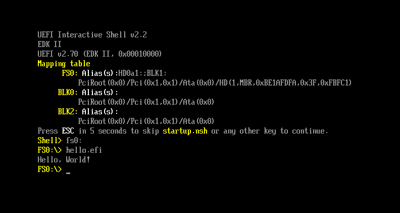

# UEFI Hello World with FASM

This project demonstrates how to create a simple "Hello world" UEFI program using **FASM (Flat Assembler)**, compile it into PE64 format, and run it via the UEFI shell using **QEMU**.

## Requirements
- **fasm** (Flat Assembler)
- **qemu-system-x86_64** (QEMU Emulator)
- **ovmf** (UEFI firmware for QEMU)
- **GNU Make**

### Installation (Ubuntu/Debian)
```bash
sudo apt update
sudo apt install fasm qemu-system-x86 ovmf make
```
## Building and Running

Step 1: Compile and Create UEFI Image
```bash
make
```
- Compiles hello.asm into hello.efi (PE64 UEFI format) using FASM.
- Copies OVMF.fd (UEFI firmware_ into the build/ directory

Step 2: Run in QEMU UEFI Shell
```bash
make qemu
```

- Launches QEMU with UEFI firmware(OVMF.fd).
- The build/ folder is mounted as a FAT filesystem.
- Access the UEFI program via the UEFI shell:
  ```bash
  Shell> fs0:
  fs0:\>hello.efi
  ```
  - You should see: Hello, UEFI World!
 
Step 3: Clean Up Build FIles
```bash
make clean
```
- Removes all generated files in the build/ directory.

## Notes
- hello.efi is a PE64 UEFI executable, created directly by fasm.
- QEMU boots using OVMF, an open-source UEFI firmware.
- The build/ folder acts a virtual FAT partition.

## Output

